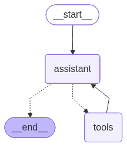
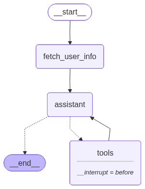
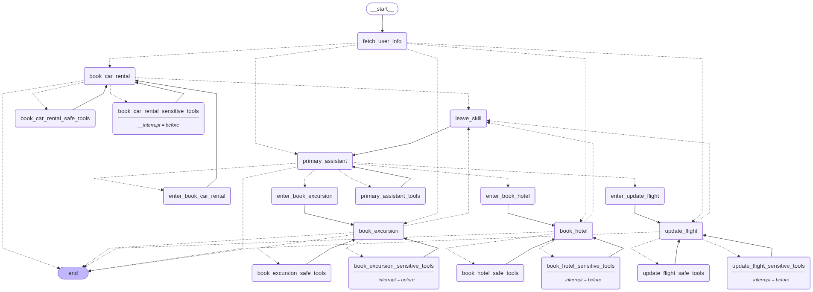

# Multi-Agent Swiss Airlines Support Assistant
This project is a sophisticated, conversational AI assistant designed to handle customer support queries for __Swiss Airlines__. It features a multi-agent architecture built with __LangGraph__ to intelligently route user requests to specialized agents for tasks like flight management, bookings, and policy lookups. The user interface is a friendly web-based chat application built with __Streamlit__.

### ✨ Features
- __Multi-Agent Architecture:__ Uses LangGraph to create a robust graph where a primary assistant delegates tasks to specialized agents (e.g., Flight Booker, Hotel Booker).

- __Stateful Conversations:__ Remembers the context of the conversation, allowing for natural, multi-turn interactions.

- __Specialized Tools:__ Agents are equipped with a variety of tools to:
    - Query a live (mock) flight database using SQL.

    - Search for and book hotels, car rentals, and excursions.

    - Perform semantic searches on a vector database of company policies for FAQ-style questions.

- __Human-in-the-Loop:__ For sensitive actions like booking or modifying a flight, the agent pauses and asks the user for explicit approval via an interactive UI button.

- __Interactive Web UI:__ A clean and simple chat interface built with Streamlit.

- __Demo Mode:__ A one-click demo mode that walks the user through a series of predefined questions to showcase the agent's full capabilities.

## 🛠️ Tech Stack & Architecture
- __Orchestration:__ LangGraph

- __Frontend:__ Streamlit

- __LLM:__ Google Gemini ```(gemini-2.5-flash)```

- __Embeddings:__ OpenAI (text-embedding-3-small)

- __Tools:__ LangChain, Tavily Search

- __Vector Store:__ ChromaDB (for policy documents)

- __Database:__ SQLite (for flight, booking, and trip data)

## 📂 Project Structure
The project is organized into a src directory to separate the application logic from other project files like the database.

```bash
.
├── .env                      # For storing API keys
├── db/                       # Holds the SQLite database and vector store
│   └── notebooks/
│       ├── part1_and_part2.ipynb
│       ├── part3.ipynb
│       └── part4.ipynb
└── src/
    ├── app.py                # Main Streamlit UI file
    ├── assistants/
    │   └── graph.py          # LangGraph agent logic and graph definition
    ├── tools/
    │   ├── __init__.py
    │   ├── car_rental_tools.py
    │   ├── excursion_tools.py
    │   ├── flight_tools.py
    │   ├── hotel_tools.py
    │   └── policy_tools.py
    └── utils/
        ├── db_setup.py
        └── vectorstore_setup.py
```

## 🚀 Setup and Installation
Follow these steps to get the application running on your local machine.

### 1. Prerequisites
```Python 3.10+```

- ```pip``` package manager

### 2. Clone the Repository
```bash
git clone <your-repository-url>
cd <your-repository-name>
```
### 3. Create a Virtual Environment
- It's highly recommended to use a virtual environment.

```Windows:```
```bash
python -m venv .venv
.\.venv\Scripts\activate
```
```macOS / Linux:```
```bash
python3 -m venv .venv
source .venv/bin/activate
```
### 4. Install Dependencies
- Create a ``` requirements.txt ``` file in the project root with the following content:

``` requirements.txt ```

```bash
streamlit
langchain
langgraph
langchain-google-genai
langchain-openai
langchain-tavily
langchain-chroma
python-dotenv
requests
pytz
pandas
openai
```
### Then, install the packages:
```bash
pip install -r requirements.txt
```
### 5. Set Up Environment Variables
Create a file named ```.venv ``` in the root directory of the project. This is where you'll store your secret API keys.

```bash
.venv
```

### Code snippet

```bash
GOOGLE_API_KEY="your_google_api_key_here"
GROQ_API_KEY="your_groq_api_key_here"
TAVILY_API_KEY="your_tavily_api_key_here"
OPENAI_API_KEY="your_openai_api_key_here"
```

__Note:__ The first time you run the app, it will automatically download the required travel2.sqlite database file and create the Chroma vector store inside your db folder.

### ▶️ How to Run
Make sure your virtual environment is activated.

Navigate to the root directory of the project in your terminal.

Run the Streamlit application with the following command:

```bash
streamlit run src/app.py
```
Your web browser should open with the application running.

### 💬 How to Use
- __Chat Interface:__ Simply type your requests into the chat box at the bottom and press Enter.

- __Demo Mode:__ Click the "Start Demo" button on the main page to begin a guided tour. Click the "Next Demo Step" button to proceed through the predefined script.

- __Tool Approval:__ When the agent needs to perform a sensitive action (like booking a flight), it will pause and present "Approve" and "Deny" buttons. The conversation will only continue after you've made a selection.

## 📊 Agent Architecture
The agent is built using LangGraph and follows a multi-agent, hierarchical structure. A primary assistant routes tasks to specialized agents based on the user's request. The graph below visualizes the flow, nodes, and conditional edges that govern the agent's behavior.

### Part1 Simple Agent Architecture

### Part2 Simple Agent Architecture with Interrupt

### Part3 Simple Agent Architecture with Tools Segration

### Part4 Final Complex Agent Architecture


